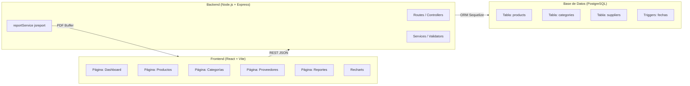
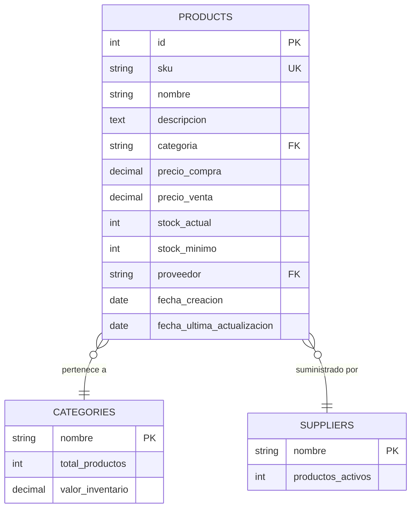

# GestiónPro — Sistema de Gestión de Inventario

Sistema full-stack para la gestión de productos, categorías y proveedores con dashboard analítico y reportes PDF.

## Stack Tecnológico

| Capa | Tecnología |
|------|-----------|
| Base de datos | PostgreSQL |
| ORM | Sequelize |
| Backend | Node.js + Express |
| Frontend | React + Vite |
| Gráficos | Recharts |
| Reportes PDF | jsreport |

---

## Instalación Paso a Paso

### 1. Prerrequisitos
- Node.js ≥ 18
- PostgreSQL ≥ 14
- npm ≥ 9

### 2. Crear base de datos PostgreSQL
```sql
CREATE DATABASE inventario_db;
```

### 3. Configurar e Inicializar Backend
```bash
cd backend
npm install
cp .env.example .env
# Edita .env con tus credenciales de PostgreSQL (DB_USER, DB_PASS, etc.)

# ⚠️ PASO CRÍTICO: Inicializar base de datos (tablas, triggers y semillas)
node database/init.js

# Iniciar servidor en modo desarrollo
npm run dev
```

### 4. Configurar y Ejecutar Frontend
```bash
cd frontend
npm install
npm run dev
```

### 5. Acceder al Sistema
- **Frontend**: [http://localhost:5173](http://localhost:5173)
- **API REST**: [http://localhost:3001/api](http://localhost:3001/api)
- **Health Check**: [http://localhost:3001/api/health](http://localhost:3001/api/health)

---

## Decisiones de Arquitectura

- **Sequelize ORM**: Se utiliza para abstraer la persistencia y gestionar la integridad referencial mediante modelos definidos en código.
- **Triggers en PostgreSQL**: Se han implementado disparadores (`AFTER INSERT OR UPDATE OR DELETE`) para mantener sincronizadas las tablas de resumen (`CATEGORIES` y `SUPPLIERS`) de forma atómica y eficiente a nivel de base de datos.
- **jsreport (Embebido)**: Se integra directamente en el backend para generar reportes PDF profesionales utilizando plantillas HTML/Handlebars, sin necesidad de un servidor externo complejo.
- **Validación Centralizada**: Se utiliza `express-validator` para asegurar que los datos de entrada cumplan con los requisitos del negocio antes de llegar a la base de datos.

---

## Estructura de Archivos

```
sistema-inventario/
├── backend/
│   ├── app.js                    ← Entry point Express
│   ├── package.json
│   ├── .env.example
│   └── src/
│       ├── config/
│       │   └── database.js       ← Conexión Sequelize
│       ├── models/
│       │   ├── Product.js        ← Modelo productos
│       │   └── CategorySupplier.js ← Categorías y proveedores
│       ├── controllers/
│       │   ├── productController.js
│       │   ├── catSupplierController.js
│       │   └── dashboardController.js
│       ├── routes/
│       │   ├── products.js
│       │   ├── categories.js
│       │   ├── suppliers.js
│       │   ├── dashboard.js
│       │   └── reports.js
│       ├── services/
│       │   └── reportService.js  ← Generación PDF con jsreport
│       └── middlewares/
│           ├── validators.js     ← express-validator
│           └── errorHandler.js   ← Manejo centralizado de errores
│
└── frontend/
    ├── index.html
    ├── vite.config.js
    ├── package.json
    └── src/
        ├── App.jsx               ← Router principal + Toast
        ├── index.css             ← Estilos globales (DM Sans)
        ├── main.jsx
        ├── pages/
        │   ├── Dashboard.jsx     ← KPIs + Charts Recharts
        │   ├── Productos.jsx     ← CRUD completo con paginación
        │   ├── Categorias.jsx    ← CRUD categorías
        │   ├── Proveedores.jsx   ← CRUD proveedores (vista tarjetas)
        │   └── Reportes.jsx      ← Descarga PDF
        ├── components/
        │   ├── Sidebar/Sidebar.jsx
        │   └── Toast.jsx
        ├── services/
        │   └── api.js            ← Capa de comunicación HTTP
        └── utils/
            └── mockData.js       ← Datos de demostración
```

---

## Endpoints de la API

### Productos
| Método | Ruta | Descripción |
|--------|------|-------------|
| GET | /api/products | Listar (paginado, filtros) |
| GET | /api/products/:id | Obtener uno |
| POST | /api/products | Crear |
| PUT | /api/products/:id | Actualizar |
| DELETE | /api/products/:id | Eliminar |

### Dashboard
| Método | Ruta | Descripción |
|--------|------|-------------|
| GET | /api/dashboard/kpis | Métricas principales |
| GET | /api/dashboard/top-categories | Top 10 categorías |
| GET | /api/dashboard/inventory-distribution | Distribución por valor |
| GET | /api/dashboard/low-stock | Productos bajo stock |

### Reportes
| Método | Ruta | Descripción |
|--------|------|-------------|
| GET | /api/reports/inventario?categoria=X | PDF inventario actual |
| GET | /api/reports/estrategico | PDF análisis estratégico |

---

## Diagrama de Arquitectura (Mermaid)



---

## Diagrama del Modelo de Datos (Mermaid)



---

## Decisiones de Arquitectura

**¿Por qué Sequelize?**
Es el ORM más maduro para Node.js + PostgreSQL. Ofrece migraciones, hooks (usados para auto-actualizar `fecha_ultima_actualizacion`), validaciones y soporte completo para queries complejas con `QueryTypes.SELECT` para los KPIs del dashboard.

**¿Por qué jsreport?**
Permite definir plantillas HTML con Handlebars y renderizarlas a PDF vía Chromium headless. Esto da control total sobre el diseño del reporte (CSS, tablas, branding), a diferencia de librerías que generan PDFs programáticamente (PDFKit, jsPDF) que son más limitadas visualmente.

**¿Por qué Recharts?**
Integración nativa con React, API declarativa basada en componentes, soporte para responsive containers y alto nivel de personalización visual con mínimo código.

**¿Por qué separar CATEGORIES y SUPPLIERS en tablas propias?**
Permite mantener integridad referencial, calcular KPIs por entidad (valor de inventario por categoría, productos activos por proveedor) de forma eficiente, y escalar el sistema para agregar más atributos a cada entidad sin modificar la tabla de productos.
